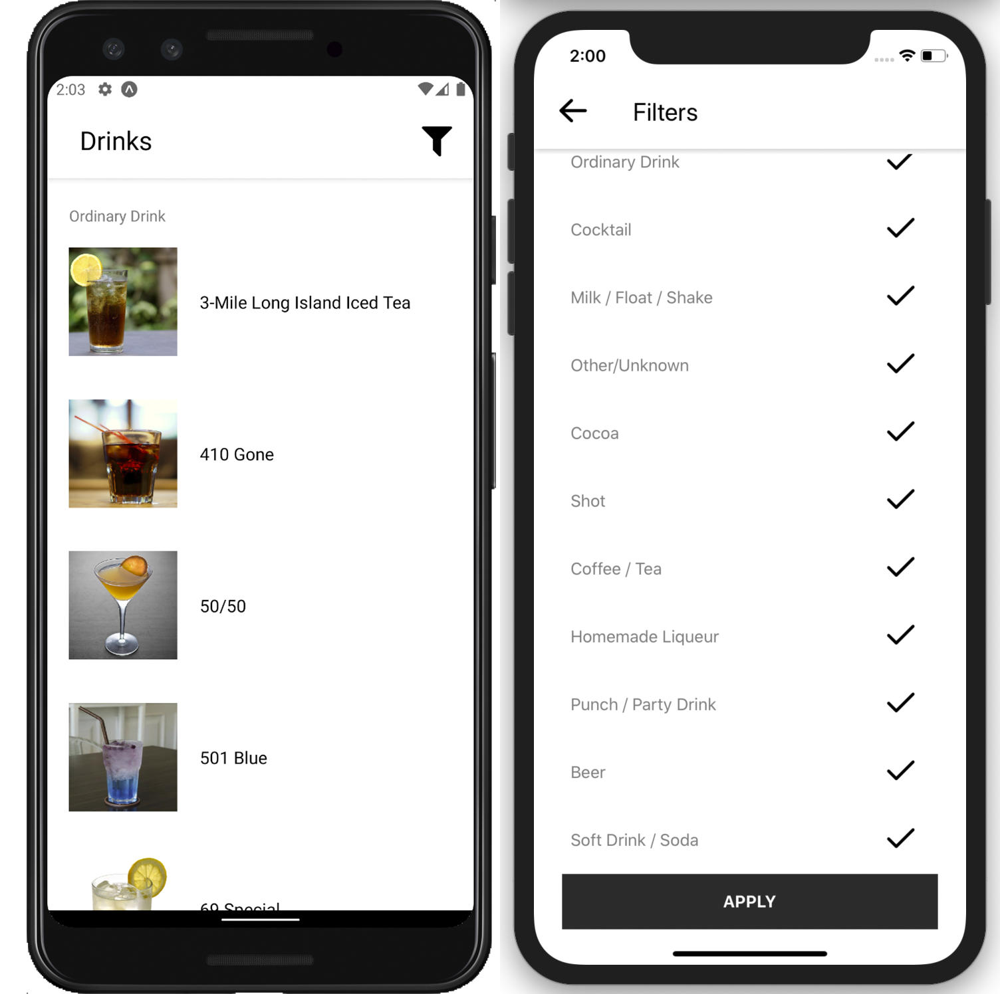

# The [Cocktail DB](https://www.thecocktaildb.com/api.php) mobile app — [Inmost](http://inmost.pro) Test Task

##### This project was bootstrapped with [React Native CLI](https://reactnative.dev/docs/environment-setup).
##### cocktaildb-expo.zip — this project was bootstrapped with [Expo CLI](https://expo.io).



## How to use it?

### Download manually

Install:

```bash
yarn install
# or
npm install
```

Run:

```bash
yarn start
# or
npm run start
```

Opening an iOS simulator:

```bash
yarn ios
# or
npm run ios
```

Opening an Android simulator:

```bash
yarn android
# or
npm run android
```

[Eslint](https://eslint.org):

```bash
yarn lint
# or
npm run lint
```

[Prettier](https://prettier.io):
```bash
yarn prettier
# or
npm run prettier
```

[Jest](https://jestjs.io):
```bash
yarn test
# or
npm run test
```
